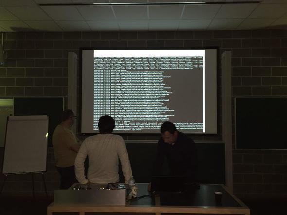
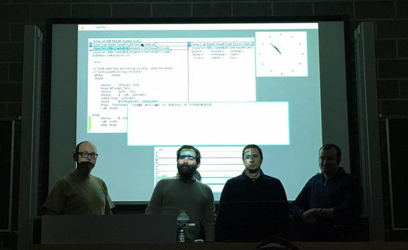
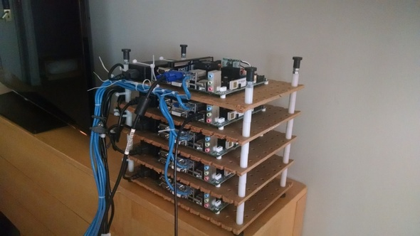
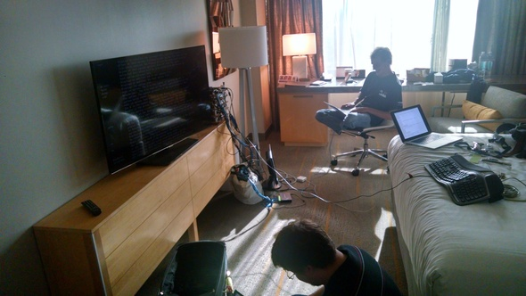
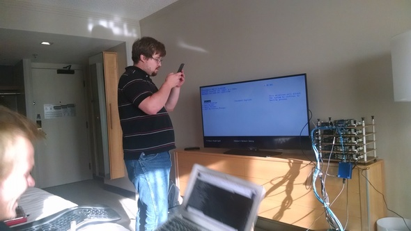

# News & events

## Harvey OS joins the Software Freedom Conservancy
Feb 28, 2017

We are very pleased to announce that Harvey OS is now an official member of the [Software Freedom Conservancy](https://sfconservancy.org/news/2017/feb/28/harveyos-joins/).

In its own words Conservancy "is a not-for-profit charity that helps promote, improve, develop, and defend Free, Libre, and Open Source Software (FLOSS) projects. Conservancy provides a non-profit home and infrastructure for FLOSS projects. This allows FLOSS developers to focus on what they do best — writing and improving FLOSS for the general public — while Conservancy takes care of the projects' needs that do not relate directly to software development and documentation."

Harvey's membership in the Software Freedom Conservancy allows us to accept donations, support new contributors and grow the community.

This is a great step for HarveyOS, giving it the possibility of making its own little place in our big Free Software community. Co-founders and contributors are all from very differents countries and cultures and working together it's always something nice. People who started this project wanted since the begining in having fun coding (again), doing it for everyone, showing it, teaching about it. And surely, joining Conservancy will grow this spirit.

From here we thank to Karen Sandler, Tony Sebro, Brett Smith and Bradley M. Kuhn for helping us to making this possible.

## Harvey is now multiarch: say hello to RISC-V
Dec 30, 2016

Ending this year, Ron G. Minnich has got Harvey running in [RISC-V](https://riscv.org/) architecture, booting Harvey on [Spike (ISA Simulator)](https://riscv.org/software-tools/risc-v-isa-simulator/) and running rc shell on it. But he never rests and now is working on bringing it to QEMU and to FPGA.
It's a big step for Harvey because we fixed some multiarch issues across the source and Ron found some bugs in timer interrupts in the hardware,
so we all learned something.

## Full virtualization: Harvey is now virtio compatible
Dec 30, 2016

Harvey has a new feature in X86_64 (amd64) architecture: now it uses the [Virtio](http://www.linux-kvm.org/page/Virtio) capabilities provided by QEMU. Follow our [wiki](https://github.com/Harvey-OS/harvey/wiki/Using-Virtio-(QEMU)) for more info. Thanks to Dmitry Golubovsky for his efforts and patience, showing that Harvey community is always happy to meet new members and receiving proposals that could grow the system.
We hope this will encourage more people to jump to the sand and come to Harvey OS community for learning, teaching and getting some fun coding.

## Go programming language on Harvey
Oct 20, 2016

Thanks to Ron G. Minnich, Harvey can build [Go](http://www.golang.org) programs natively. Many interesting projects have now the door open. Read our [wiki](https://github.com/Harvey-OS/harvey/wiki/Go-on-Harvey) about how to build Go for Harvey and then, just have fun writing Go programs.

## Running Harvey with Minimega
Sep 23, 2016

Do you wnat to see how to run 30 cpu servers with [minimega](http://minimega.org/)?
Now in [Harvey's wiki](https://github.com/Harvey-OS/harvey/wiki/Using-minimega-to-run-dozens-of-Harvey-VMs) we'll teach how to make your own cloud of Harvey machines.

## Clang, Intel C Compiler and APEX
May 30, 2016

Now Harvey is being built with clang and icc.

>Though work on gcc port is in progress.
>This means that clang is scheduled now to be ported.
>Thanks to Ron Minnich, Harvey can be built with icc now as a third toolchain. Always trying to keep the code
>more portable as possible.

APEX is released.

>We imported many things from [musl libc](https://www.musl-libc.org/).
>Now a new stdio and others are available, improving the works on gcc and clang ports.
>There are still some parts pending to be included, like musl complex and stdioext code. Trying to do the software porting tasks easier.
>You can take a look at [its repo](https://github.com/Harvey-OS/apex) and [its wiki](https://github.com/Harvey-OS/apex/wiki).
>Also we are using clang to build APEX now.

FS project.

>We started to work on some FS alternative to fossil, looking for a main file system for Harvey, though we still use fossil for disks.

If you are interested in something of this or in start a new project, just tell us about it in our [list](http://groups.google.com/forum/#!forum/harvey).

## Harvey at FOSDEM 2016  
January 30/31, 2016

European members of core team were at FOSDEM2016.
Changing impressions, suggestions, debating mainlines, drinking beer, meeting people...
We assisted to some devrooms and lightning talks, all of them interesting.

Here there are a couple of pictures trying to show Harvey as it was at that moment.

Building and preparing the system

Running Harvey! (Left to right: Keith, Sevki, Álvaro and Rafael)

---
## Things you can do now in Harvey 
December 20, 2015

Many new things have been changed or implemented last months. We were working a lot and now, even for our own eyes, we went far away than we thought at the begining, almost a year ago. But we want more, so remember: we need programmers. Are you ready to join Harvey?

Harvey has now an almost stable kernel:

>What means you can start to do programs and experiments in it.

We are able to use [drawterm](https://github.com/0intro/drawterm) with Harvey:

>Don't forget to try mclock, courtesy of John DeGood.

Factotum is working:

>Well, if you don't know what it means, you should to read [some lines](http://plan9.bell-labs.com/plan9/factotum.html) about it first.

System console are now splitted in three types:

>And all of them out of kernel in user space, thanks to Giacomo Tesio. Just check the code to see how they work and the purpose of everyone.

Now we are able to play with Go programming language:

>There are some limitations, This is a work in progress. Never quite graceful to Ron Minnich for this and many other things.

Harvey has now Fossil and Venti:

>So you can set up a disk (real and virtual) for your system installation. Check our wiki to see how to do it. Courtesy of Rafael Fernández, who fought hard with Fossil.

And don't forget you can come to meet us in [Fosdem 2016](http://fosdem.org), you will recognize us for our Harvey T-Shirts. Do you want one of them? check [here](http://www.zazzle.com/harvey_os_supplies).

---

## Using gdb to debug Harvey 
August 8, 2015

A page has been added to the wiki which describes how to debug Harvey using gdb.  See [Debugging Harvey in gdb](https://github.com/Harvey-OS/harvey/wiki/Debugging-Harvey-in-gdb) for details.

---

## APE is ready 
August 6, 2015

APE (the [ANSI/POSIX Environment](http://plan9.bell-labs.com/sys/doc/ape.html)) has been finally given the green light:

>ANSI people, it's your time. Let's go, doors are opened. Ape is working.
>Improvements, suggestions are welcome. Ports can be done. Wiki is ready in github.

This means a whole host of ports can be on their way fueled by POSIX -sort of- compliance:

>  There are some aspects of required POSIX behavior that are impossible or very hard to simulate in Plan 9.
>  Experience has shown, however, that the simulation is adequate for the vast majority of programs.

A quick [getting started with APE](https://github.com/Harvey-OS/ape/wiki/Getting-Started) guide is being drafted in the wiki.

---

## Broken scheduler, working scheduler
August 1, 2015  

Despite the hot summer, Harvey has been progressing steadily during these months. So, a big THANK YOU to everyone involved, you all rock!

Obviously, it can't all be happy days: resident guru Aki Nyrhinen has just proved how things can easily fall into chaos by detecting a major defect in Harvey's core. Straight from the horse's mouth:

>it turns out that the scheduler in harvey is badly broken.
>it does not do time sharing at all, among other things.
>it also crashes instantly if squidboy is enabled (>1 core).
>the procs aren't really reusable at all, because the kernel structures are apparently infested with pointers to the procs when one does an exit.
>there's a lot to be fixed here.

Undeterred by the mess, and in a question of hours, the fire has been put out:

>Alright, after 4 hours of furious editing and undoing damage to the boot code, I've got harvey booting up with the ndnr() in squidboy commented out.

Some (thorough?) measurements after the fix:

>Boot faster.
>CPU at 13% as usual (we still have pending a new random).
>No weird behaviours.
>Nice job!

Hooray!

---

## USENIX presentation slides available 
July 20, 2015

Here are Harvey's [presentation slides](docs/Harvey-Usenix-2015-ATC-BOF-slides.pdf) at USENIX 2015 ATC BOF.

We will update this note when we can link to a video of the talk.

---

## Looking for developers! 
July 15, 2015

For the next couple of months, the project is looking for developers to step up and help get Harvey ready for prime time.

> "I think the big goal for the next two months, the single most important goal, is to move a needle: we want more people contributing"

There still exist areas for continued development, and YOU can make a difference. This experience can make for an ideal project for Operating System courses and the like. Please talk to us!

> "For new people: we have troubles with sdiahci.c, ahci driver. So we haven't local disk for now. It's not blocking at all, but other improvements depends on it. But, what would you like to do with Harvey meanwhile?"

---

##Harvey at USENIX 2015 
July 8, 2015

It's usenix and we have a BOF tomorrow night, so we have to get the
minicluster going. Five AMD Persimmon boards in a stack and 1 Minnow
MAX.

We had really high hopes for the minnow max but it is a bit of a
disappointment. Super neat size -- see the little blue box hanging
from an ethernet cable in the 5th picture? It was kind of exciting to
see so much in such a small box.

We've concluded that to make this board usable for Harvey we're going
to need to swap out UEFI for some other firmware. it took us 15
minutes just to walk through enough of the commands and dialogues to
realize we can only boot from a FAT-formatted SD card. FAT
formatted. 2015. What's wrong with this picture?

So then tried PXE boot. See John taking a movie of the TV? It's
because when UEFI pxeboot fails, it puts the failure frame up for 1/30
second and clears it. So John took a movie, and then we watched the
movie frame by frame to see the error. 

Then we hit the next problem: once we
got the special version of GRUB booting over the LAN, it told
us we wouldn't have a visible console. We need a console.

The AMD stack, with three coreboot nodes and two AMI BIOS nodes,
worked better. The only thing that went wrong is that the AMI BIOS
breaks pxelinux.0 -- it loads and gets to some point, and then instant
reset. We can still boot harvey on the AMI BIOS nodes, but only from a USB stick. 
We'll be reflashing these too. 

Harvey mini-cluster ready to fire up (or catch fire)

John on the floor, trying to make the minnowmax boot
Harvey, Aki on the chair making Harvey build on a mac and boot off of one.

John decided taking a video of the boot sequence would
be the best way to capture the sub-second error message.
